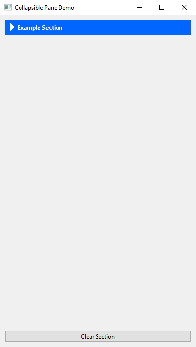

# CollapsiblePane (PySide6)

The `CollapsiblePane` is a reusable Qt widget for PySide6 that allows dynamic expansion and collapsing of a content area. It mimics the behavior of JavaFX’s `TitledPane` and is designed to group form sections, tool panels, or other widgets under an interactive toggle button.

---

## 📆 Class Overview

```python
class CollapsiblePane(QWidget):
```

A custom QWidget subclass that includes:

- A toggleable title bar (`QToolButton`)
- A collapsible content area (`QScrollArea`)
- Animation support using `QParallelAnimationGroup` and `QPropertyAnimation`

---

## ✅ Key Features

- Smooth vertical expansion/collapse animations
- Fully customizable title bar and content area styles
- Supports custom styling via colors, borders, and fonts
- Layout-agnostic content insertion via `widget property`
- Clean and minimal default design, easily adaptable

---

## 📸 Demo Preview

| Collapsed | Expanded |
| --------- | -------- |
|           |  |

---

## 🧪 Usage Example

```python
class Window(QMainWindow):
    def __init__(self, parent=None):
        super().__init__(parent)
        self.setWindowTitle("Flex Zone 🧹")

        # Create the collapsible pane
        section = CollapsiblePane("🔥 Ultimate Pane of Power", 150, self)

        # 🎨 Customize title bar
        section.set_title_bar_style(background_color="#0066ff", foreground_color="#FFFFFF")
        section.set_content_style(
            background_color="#FFFFFF",
            border_color="#0066FF",
            border_width=2,
            border_style="solid"
        )

        # 💎 Create a widget to hold the layout
        content_widget = QWidget()
        content_layout = QVBoxLayout(content_widget)

        content_layout.addWidget(QLabel("📝 Enter your details:"))
        content_layout.addWidget(QLineEdit("Name here..."))
        content_layout.addWidget(QLineEdit("Email address..."))

        content_layout.addWidget(QLabel("🕽️ Choose a category:"))
        combo = QComboBox()
        combo.addItems(["Developer", "Designer", "Hacker", "Wizard"])
        content_layout.addWidget(combo)

        content_layout.addWidget(QCheckBox("Subscribe to newsletter 📬"))
        content_layout.addWidget(QRadioButton("Light Mode ☀️"))
        content_layout.addWidget(QRadioButton("Dark Mode 🌙"))

        content_layout.addWidget(QLabel("🔊 Volume:"))
        slider = QSlider(Qt.Horizontal)
        slider.setValue(40)
        content_layout.addWidget(slider)

        progress = QProgressBar()
        progress.setValue(70)
        content_layout.addWidget(progress)

        content_layout.addWidget(QSpinBox())
        content_layout.addWidget(QDateEdit())

        content_layout.addWidget(QLabel("🧾 Bio:"))
        text_edit = QTextEdit()
        text_edit.setPlaceholderText("Tell us something cool...")
        content_layout.addWidget(text_edit)

        content_layout.addWidget(QPushButton("🚀 Launch!"))

        # Set the content widget using the property
        section.widget = content_widget

        # 🌟 Main layout
        container = QWidget()
        main_layout = QVBoxLayout(container)
        main_layout.addWidget(section)
        main_layout.setAlignment(section, Qt.AlignTop)  # <--- THIS does the magic
        self.setCentralWidget(container)
        
if __name__ == "__main__":
    app = QApplication(sys.argv)
    window = Window()
    window.resize(400, 300)
    window.show()
    sys.exit(app.exec())
```

---

## 🔧 Public Methods

### `__init__(title: str = "", animation_duration: int = 100, parent: QWidget = None)`

Creates a collapsible pane with a given title and animation duration (in ms).

---

### `set_title_bar_style(background_color: str, foreground_color: str)`

Sets the background and foreground (text) color of the title bar toggle button.

---

### `set_content_style(background_color="#ffffff", border_color="#cccccc", border_width=1, border_style="solid")`

Sets the content area's background and border styling.

---

### `widget` property

Sets the widget to the pane.

---

### `toggle(collapsed: bool)`

Toggles the expansion or collapse of the pane. Called automatically on toggle button interaction.

---

## 💡 Design Notes

- The content area is implemented as a `QScrollArea`, allowing it to be expandable but scroll-free by default.
- Animations are coordinated for both widget height and content height to provide smooth transitions.
- The `QToolButton` is configured with a text label and arrow indicator, acting as the toggle.

---

## 🏗️ Dependencies

- PySide6 (`pip install PySide6`)

---

## 🮽 Inspiration

This widget is conceptually inspired by **JavaFX’s **`` , ported to PySide6/Qt with support for custom styling and animations.

---

## 📜 License

This code is intended for internal or educational use. If needed, wrap with your preferred open-source license.

